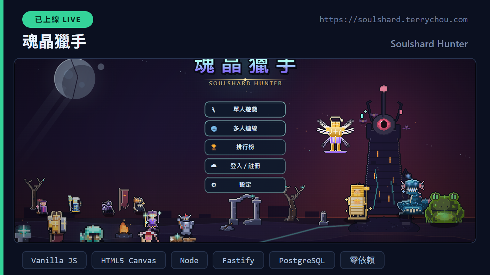
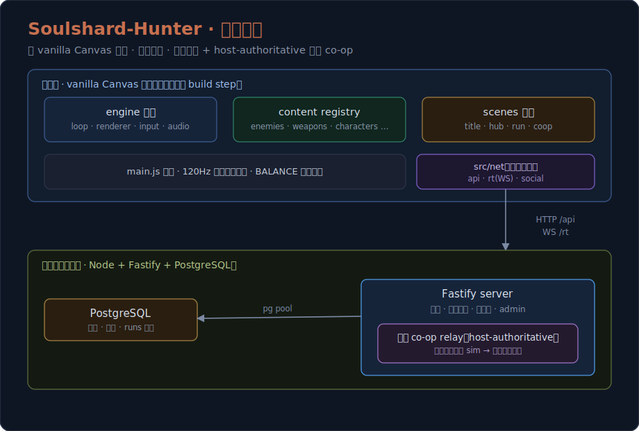
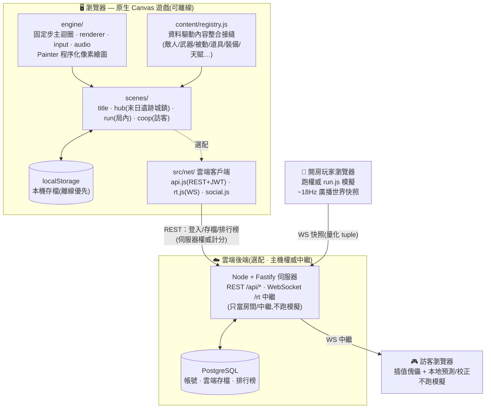

# 魂晶獵手 · Soulshard Hunter

> 像素風 roguelike 生存遊戲（Vampire-Survivors-like）——原生 HTML5 Canvas + ES Modules,零建置、零依賴;可選配雲端帳號與 1~3 人即時連線合作。

<p align="center"></p>

[](https://github.com/q86865511/Soulshard-Hunter/actions/workflows/ci.yml)
[](src/main.js)
[](tools/serve.mjs)
[](server/package.json)
[](server/package.json)
[](server/README.md)
[](docs/MULTIPLAYER_PLAN.md)
[](LICENSE)

<p align="center"></p>

> 只需走位,武器自動瞄準開火。在 20 分鐘的生態大地圖迎戰不斷湧出的怪潮:
> 升級三選一、滿級進化合成,帶回金幣在城鎮解鎖角色、天賦與設施;
> 也可選擇性連上雲端——帳號、跨裝置存檔、共享排行榜、1~3 人即時連線合作。

- 🎨 **美術 100% 程式即時生成**(無任何外部圖片素材);音效 WebAudio 合成、配樂為 12 首實錄曲目(依遊戲狀態交叉淡入,合成器為後備)
- 🕹️ **可純單機離線遊玩**:雲端與多人皆為選配,未登入／連不上自動退回本機存檔,不影響遊玩
- ⚙️ **前端零安裝**:一個靜態伺服器即可執行

**目前進度**:Round 21 完成,對外版本 **V2.0**(V1.0=R18 / V1.5=R19 / V2.0=R20)。已實作末日遺跡城鎮、無盡／每日／週常模式、資料驅動 Boss 招式與局內事件、全 27 角色專屬武器。逐輪更新詳見 [`docs/changelog/`](docs/changelog/)(最新 `ROUND21.md`)。

## 目錄

- [這是什麼](#這是什麼)
- [技術亮點](#-技術亮點)
- [架構](#️-架構)
- [快速開始](#-快速開始)
- [測試](#-測試)
- [遊戲操作](#遊戲操作)
- [遊戲流程](#遊戲流程)
- [特色系統](#特色系統)
- [內容規模](#內容規模)
- [線上多人(選配)](#線上多人選配)
- [專案結構](#專案結構)
- [擴充與開發](#擴充與開發)
- [已知限制](#️-已知限制)
- [授權](#-授權)
- [文件索引](#文件索引)

## 這是什麼

一款 **Vampire-Survivors-like** 的像素風 roguelike 生存遊戲。玩家只需走位,身上的多把武器會**自動瞄準開火**;在一張限時 20 分鐘的生態大地圖中迎戰由弱到強、不斷湧出的怪潮,透過「升級三選一」與「滿級進化合成」即時構築自己的 build,最後在第 20 分鐘擊敗生態最終首領破關。每局帶回的金幣投入可走動的**末日遺跡城鎮**做永久成長——解鎖角色、天賦、設施、武器鍛造與故事。

技術上它是一個**零建置、零執行期依賴**的純前端遊戲:**原生 HTML5 Canvas + ES Modules**,所有像素美術都在程式中**程序化生成**(沒有任何外部圖片素材),只有 `assets/music/` 的 12 首實錄配樂屬於外部資產。一個靜態伺服器即可開跑。

雲端與多人是**選配且離線優先**:沒登入或連不上時自動退回本機 `localStorage`,單機體驗完全不受影響。接上後端後,可獲得帳號、跨裝置雲端存檔、伺服器權威計分的共享排行榜,以及 **1~3 人即時連線合作**(採主機權威中繼架構)。

## ✨ 技術亮點

- **零建置純前端**:原生 HTML5 Canvas + ES Modules,無打包器、無框架、無執行期依賴;`node tools/serve.mjs` 即可開跑。
- **100% 程序化像素美術**:全部 sprite 由程式以共用 `Painter` 像素繪圖 API + 調色盤即時生成並快取,無任何外部圖片素材;敵人、武器、角色、城鎮、生態地貌皆走同一套風格管線。
- **資料驅動內容架構**:所有敵人/武器/被動/道具/裝備/天賦/設施透過單一 `content/registry.js` 整合接縫註冊,新增內容不碰 gameplay 程式;難度/經濟/節奏數值全部集中在 `src/game/balance.js`。
- **multi-agent workflow 量產內容**:核心內容之外,以「生成 → 對抗式審查」的多代理工作流大量產出 63 敵人 / 43 武器 / 27 角色 / 54 被動 / 60 裝備…,經 `tools/integrate.mjs` 自動整合且**故障隔離**(單一 gen 檔出錯不拖垮整體)。
- **120 Hz 固定步模擬**:固定步主迴圈壓低輸入延遲;空間網格(uniform spatial grid)取代 O(n²) 鄰近查詢,在 260 敵人上限仍保持穩定。
- **主機權威即時合作**:開房玩家的瀏覽器跑**未修改的權威 `run.js` 模擬**並以 ~18Hz 廣播量化後的世界快照;Node 伺服器只當房間/中繼不跑模擬。訪客場景為純插值傀儡 + 自身 avatar 的本地預測/校正。**單機路徑零改動**。
- **伺服器權威計分**:排行榜分數由後端以 `kills/stage/time/difficulty/reaper` 重算並做合理性檢查,忽略客戶端宣稱值,杜絕前端竄改。
- **完整雲端後端**:Node + Fastify + PostgreSQL 單一程式同時提供 REST API 與 WebSocket 中繼;含 JWT 帳號、跨裝置存檔、多模式排行榜、好友/大廳/觀戰/斷線重連,以及 7 分頁管理後台(封鎖、踢人、稽核日誌、數據統計)。
- **CI 與離線優先設計**:GitHub Actions 跑 168 項後端 smoke/social 測試;前端附離線自測 hook(`__DBG.coopRoundTrip/coopSilenceTest/coopBossSyncTest`)可在無雙分頁、無中繼伺服器的情況下驗證 host→guest 全鏈路。

## 🏗️ 架構

整體分兩塊:**瀏覽器端的原生 Canvas 遊戲**(完全可離線執行)與**選配的雲端後端**(帳號 / 存檔 / 排行榜 / 即時合作)。前端以引擎層 → 內容註冊表 → 場景的方式組裝;雲端採**主機權威中繼**——遊戲模擬只跑在開房玩家的瀏覽器,Node + Fastify 伺服器只負責 REST API 與 WebSocket 房間/中繼,PostgreSQL 持久化帳號、存檔與排行榜。頂部 hero 圖為整體鳥瞰,以下 mermaid 為資料流:



更細的子系統說明見 [`CLAUDE.md`](CLAUDE.md)(開發指南);多人連線設計與現況見 [`docs/MULTIPLAYER_PLAN.md`](docs/MULTIPLAYER_PLAN.md)。實際的目錄對應見[專案結構](#專案結構)一節。

## 🚀 快速開始

```bash
# 在專案根目錄(專案附了一個無快取的 Node 靜態伺服器)
node tools/serve.mjs
# 瀏覽器開 http://localhost:5173
```

不需要 `npm install`、不需要建置。想啟用雲端／多人功能再看[線上多人](#線上多人選配)一節(後端可一鍵 Docker 起)。

## 🧪 測試

後端有完整的 smoke / social 測試,並由 GitHub Actions 在每個 PR 與 `main` push 上自動執行(見上方 CI badge)。測試用 in-memory 假資料庫,**不需 Postgres、不開 port**:

```bash
cd server
npm ci          # 安裝相依(CI 用 npm ci;本機開發用 npm install 亦可)
npm run check   # 語法檢查(server 端各模組 node --check)
npm test        # smoke(103)+ social(65)= 168 項
```

CI 流程定義於 [`.github/workflows/ci.yml`](.github/workflows/ci.yml)(觸發於 PR 與 `main` push),實際測試步驟收斂在可重用的 [`.github/workflows/server-test.yml`](.github/workflows/server-test.yml) 與 [`.github/workflows/frontend-test.yml`](.github/workflows/frontend-test.yml),並由部署流程 [`.github/workflows/deploy.yml`](.github/workflows/deploy.yml) 共用為部署前關卡——**server 與前端任一紅燈都不部署**。

前端為純 ESM、無建置,不走 `node --check`;自動化驗證走 **headless Chromium smoke 測試**(`cd test && npm ci && npm run test:frontend`,測試依賴隔離在 `test/`,遊戲 runtime 仍零依賴):涵蓋 boot、registry 計數基準、場景切換、首局 story 暫停與離線合作自測。開發時也可**重載頁面 + 瀏覽器內自測**:`window.__DBG` 提供 `reg()`(內容註冊表計數)、`startRun()`、`nav(name)`、`pump(n,dt)`,以及 `coopRoundTrip()` / `coopSilenceTest()` / `coopBossSyncTest()`(在無雙分頁、無中繼伺服器下驗證 host→guest 全鏈路)。細節見 [`CLAUDE.md`](CLAUDE.md) 的 *Run / test* 一節。

## 遊戲操作

| 按鍵 | 動作 |
| --- | --- |
| `WASD` / 方向鍵 | 移動(武器自動瞄準開火,無需手動攻擊) |
| `Shift` | 衝刺(短暫無敵;可在設定中重新綁定) |
| `E` | 互動(城鎮站點與 NPC / 地圖互動物 / 寶庫開鎖 / 通關後離場) |
| `1` `2` `3` | 升級時選擇強化卡片 |
| `B` | 隨時開啟**魂晶／鐵砧商店**(不綁地圖位置) |
| `Tab` | 查看當前 build(武器 / 被動 / 裝備 / 羈絆 / 數值,圖示可懸停看說明) |
| `M` | 放大地圖(半透明浮現於畫面中央,再按關閉) |
| `空白` | 城鎮中快速開啟出擊面板 |
| `Esc` | 暫停選單 / 設定(音量、震動、按鍵設定、重看教學…);城鎮中為選單(帳號 / 多人 / 排行榜 / 回報) |

地面道具**撿起即用**(無道具欄);裝備撿取會跳出**前後數值差異**的選擇選單。每位角色武器上限 **6**、被動上限 **14**、武器等級上限 **Lv.7**(角色等級無上限)。

### 已知限制:平台支援

目前正式支援 **鍵盤＋滑鼠**(桌面瀏覽器)。手機/平板上畫面會自動縮放,但**觸控目前僅映射為滑鼠指標**——完整的觸控移動與動作操作(虛擬搖桿、衝刺、互動)尚未實作,角色無法只靠觸控移動;窄視窗或觸控裝置會在標題頁看到「建議使用實體鍵盤」提示。

## 遊戲流程

1. **城鎮(Hub)**——可走動的**末日遺跡城鎮**(多地圖:戶外遺鎮 + 6 棟可進入的室內,踩光圈進出門):教堂買天賦、鐵匠鋪鍛造武器與蓋設施、公會接任務與升聲望、衣帽店買造型、成就殿堂與個人小屋(可擺設裝飾與小寵物),加上魂晶銀行借款、NPC 好感度,以及約 10 位可對話 NPC。廣場的**圖鑑石碑**記錄你經歷過的武器／被動／Boss 與已發現的進化配方(未發現的保持剪影與 ？？？),並依進度給出 1~3 個**推薦目標**;成就殿堂預設顯示「聚焦」清單(接近完成或有實質獎勵)。部分城鎮機能依生態／公會進度逐步解鎖。走向傳送門開啟**出擊面板**:選角色 × 生態 × 難度(劇情～D5),生態通關後解鎖**無盡**模式;另有**每日挑戰**與**週常懸賞**。
2. **一局出擊**——一張超大生態地圖、限時 **20 分鐘**。威脅等級隨時間 1→約 13 爬升,同時段只出 1~3 種怪並輪替;地圖散布陷阱地形、互動物、**隱藏房間**(一次性永久獎勵)與**守護怪＋鑰匙＋寶庫**。每 **5 分鐘**降臨一隻各不相同的**小王**(擊殺掉落贊助者事件三選一),期間穿插特殊事件(怪物包圍縮圈、希格斯炸彈雨、提摩蘑菇,以及自爆狂徒、魂晶詭雷、滾岩魔、寶藏哥布林…)。首領採**資料驅動多階段招式**(跳躍重砸、魂柱囚籠、三連衝撞、地裂衝擊波,皆有預警)。
3. **構築成長**——升級三選一(新武器／武器升級／被動,卡片依**四階稀有度**上色);武器滿級後可**進化合成**(2 把滿級,或 1 滿級＋特定被動——遊戲會提示「可合成」但不公開公式);`B` 開商店買裝備鐵砧與能力值鐵砧。
4. **最終決戰**——第 20 分鐘**最終首領**降臨,擊敗即破關 → 解鎖下一生態與更高難度;破關 30 秒後隱藏**死神**降臨——可擊殺(傳說獎勵),也可按 `E` 直接離場。
5. **結算回城**——結算分數與傷害佔比排行、上傳排行榜;金幣帶回城鎮投入永久成長,推進成就與故事。

## 特色系統

### 局內戰鬥

- **自動攻擊構築**:多武器同時開火＋被動疊加,攻速隨局內時間由慢到快;進化合成、羈絆(build 組合觸發加成)、角色專屬武器(只進本人鐵砧)
- **異常狀態**:緩速／流血／灼燒／中毒／暈眩／擊飛,玩家與怪物雙向適用;首領為多階段戰
- **事件與抉擇**:小王掉落的**贊助者三選一**(16 位具名贊助者,持續性效果)、詛咒強化(強效附代價)、祝福神龕、一次性稜彩祝福
- **局內經濟**:魂晶商店(裝備三選一／能力值鐵砧三選一,含遞減收益)、裝備前後數值差異顯示、四階稀有度貫穿所有掉落與卡片

### 城鎮與長期成長

- **永久成長**:4 系天賦樹＋設施(消費隨購買次數動態漲價)、武器**鍛造**(局外等級＋詞綴)、**魂晶銀行**(依公會階級借款、下局結算自動連本帶利償還)
- **公會**:12 階聲望(含階級獎勵)、一般／隱藏任務、前置任務鏈、可同時追蹤多個(常駐畫面左側)
- **終局模式**:**無盡**(20 分鐘後疊加 12 種詛咒、記錄最久存活)、**每日挑戰**(依日期決定生態＋角色＋3 變異、進度獨立)、**週常懸賞**(每週 9 選 3);皆有獨立排行榜
- **收集**:219 項成就(許多綁內容解鎖、含隱藏成就與專屬篩選)、19 章故事任務、角色造型商店(每 30 分鐘隨機進貨、1% 隱藏全身造型、每週特賣)
- **新手體驗**:開場故事過場、城鎮嚮導、首局戰鬥提示、HUD 導覽——皆可由 Esc 選單重看

### 體驗與品質

- **120 Hz 固定步模擬**(低輸入延遲)、可調震動(瀕死才劇烈)、按鍵重綁、存檔槽位
- **玩家回報系統**:Esc 選單送出問題／建議(分類＋描述＋截圖附件:貼上／選檔／拖放),未登入也能送
- **管理後台**(管理員帳號):7 分頁主控台——總覽／玩家／對局／廣播走馬燈／回饋／稽核日誌／數據統計,支援封鎖帳號與 IP、踢人、刪除對局
- 所有難度／經濟／節奏數值集中於 [`src/game/balance.js`](src/game/balance.js),平衡經多輪模擬調校

## 內容規模

核心內容＋多輪 **multi-agent workflow(生成 → 對抗式審查)** 量產,全部含程序化像素美術:

| 類別 | 數量 |
| --- | --- |
| 敵人(含 10 名生態最終首領＋小王＋隱藏死神＋4 種局內事件怪) | **63** |
| 自動武器(含進化合成與隱藏房專屬) | **43** |
| 可玩角色(含隱藏英雄) | **27** |
| 被動能力(含詛咒強化與異常狀態被動) | **54** |
| 裝備(含史詩／稜彩與傳說飾品) | **60** |
| 道具(含能力值鐵砧) | **28** |
| 生態系(各具獨特地貌與專屬裝飾,非換色換皮;皆有專屬最終首領) | **10** |
| 成就 / 故事章節 | **219 / 19** |
| 羈絆 · 角色專屬武器(全角色皆有) · 贊助者事件 | **12 · 27 · 16** |
| 角色造型(含 5 款隱藏全身造型) | **16** |
| 天賦 / 設施 | **20 / 11** |
| 實錄配樂曲目 | **12** |

## 線上多人(選配)

完全**離線優先**:未登入或連不上時自動退回本機 `localStorage`,不會卡開機或遊玩。

- **Phase 1 — 雲端地基**:帳號、跨裝置雲端存檔、共享排行榜。**伺服器權威計分**——排行榜分數由伺服器以 `kills/stage/time/difficulty/reaper` 重算並做合理性檢查,忽略客戶端宣稱值。
- **Phase 2 — 即時合作(共視窗)**:1~3 人合作＋好友／大廳／邀請／觀戰／斷線重連。採**主機權威中繼**(host-authoritative relay):開房玩家的瀏覽器跑權威模擬並以 ~18Hz 廣播世界快照,Node 伺服器只當房間／中繼(不跑模擬);各客戶端鏡頭各自跟隨自己。**單機路徑完全不變**。

設計細節與現況見 [`docs/MULTIPLAYER_PLAN.md`](docs/MULTIPLAYER_PLAN.md)。

### 後端:本機啟動

後端在 [`server/`](server/)(**Node + Fastify + PostgreSQL**;JWT + bcryptjs + zod + `ws`),同一支程式同時提供 REST API(`/api/*`)與 WebSocket 中繼(`/rt`):

```bash
cd server
# 一鍵起(Docker,含 Postgres,資料持久化於 pgdata volume)
JWT_SECRET=$(node -e "console.log(require('crypto').randomBytes(48).toString('hex'))") docker compose up --build
# API + /rt → http://localhost:8787 ; Postgres → localhost:5432

# 無 Postgres 的純前端測試(記憶體後端,重啟即清空)
npm install && npm run dev:fakedb

# 後端測試(帳號/存檔/排行榜/回饋/後台 + 好友/房間/中繼,共 103 + 65 項)
npm test
```

> **存檔持久性**:本機 `localStorage` 一直都在(綁瀏覽器、跨重啟);雲端存檔只有在**真的接了 PostgreSQL 的部署**才持久。`dev:fakedb` 僅供測試。

### 後端:正式部署

- 🚀 完整部署指南(Oracle Cloud + HTTPS + 連線實測):[`docs/DEPLOY.md`](docs/DEPLOY.md)
- **CI/CD**:push 到 `main` 經 GitHub Actions 自動部署(部署前先過 [`server-test.yml`](.github/workflows/server-test.yml) 測試關卡,見 [`.github/workflows/deploy.yml`](.github/workflows/deploy.yml))

### 前端連線

連線位址由 [`src/net/api.js`](src/net/api.js) 自動判斷,**無需設定**:開發時(頁面在 localhost)走 `http://localhost:8787`;正式環境與 API 同源,走相對路徑 `/api/...` 與 `wss://<同網域>/rt`。可用 `localStorage['soulshard.api']` 手動覆寫(測試用)。

登入後 JWT 存於 `localStorage`:REST 以 `Authorization: Bearer` 帶,WebSocket 因瀏覽器不能設標頭改以 `/rt?token=` 帶;後端以 `CORS_ORIGIN` 白名單限定來源。

## 專案結構

```
index.html                      Canvas + 載入畫面 + 全域錯誤攔截
src/
  main.js                       啟動:接線引擎/內容/場景,120Hz 固定步主迴圈
  engine/                       與遊戲無關的引擎層
    loop.js  math.js  input.js  renderer.js(相機/世界↔螢幕/UI)
    palette.js  sprites.js(程序化像素繪圖 API + 註冊表)
    particles.js  audio.js(實錄配樂 + WebAudio 合成後備)
  art/                          程序化美術(sprite 定義;title_scene/biome_*/town_ruin_* 各主題分檔)
    gen/                        ← workflow 生成的美術(自動整合、故障隔離)
  net/                          ← 雲端 + 即時連線客戶端(離線優先)
    api.js(REST+JWT)  rt.js(即時 WS)  ui.js(帳號/排行榜/後台)  social.js(好友/大廳)
  game/
    state.js                    存檔/META、run 生命週期、基礎數值;雲端同步接點
    scene.js  scenes/           title / hub(城鎮) / run(局內) / coop(訪客合作)
    world.js  maps.js  floor.js 世界(磚塊碰撞/實體/戰鬥;players[] 多人化);makeCamp 遺鎮外場＋makeInterior 室內
    player.js  enemy.js  projectile.js  pickup.js  hud.js  progression.js
    balance.js                  ← 所有難度/經濟/節奏數值集中於此
    net/                        ← 合作協定:protocol.js(快照編解碼) coophost.js coopbridge.js
    content/
      registry.js               ← 所有內容的註冊表(整合接縫)
      enemies/weapons/abilities/items/equipment/talents/facilities/...js
      gen/                      ← workflow 生成的內容(自動整合、故障隔離)
tools/  serve.mjs(開發伺服器)  integrate.mjs(workflow 輸出整合)
server/                         ← 後端:REST API + /rt 即時中繼
  src/  server.js  db.js  realtime.js(房間/在線)  social.js(好友)  wsgw.js(WS 閘道)
assets/music/                   ← 12 首實錄配樂
```

## 擴充與開發

內容與美術完全**資料驅動**,經 [`src/game/content/registry.js`](src/game/content/registry.js) 註冊:

- **新敵人**:`defineAnim(name, w, h, frames, draw)` 畫 sprite → `Enemies.register({ id, sprite, ai, hp, ... })`(AI 可選 `chase/flyer/shooter/charger/wander`,`boss:true` 自動多階段)
- **新武器／被動／道具／裝備**:對應 `Xxx.register({...})`＋`defineIcon('weapon_'+id, bg, draw)` 慣例命名圖示
- **像素繪圖 API**(`Painter`):`px/rect/line/ellipse/ring/outline/glow/aura/...`＋共用調色盤 `P`,確保風格一致

完整開發指南(架構細節、慣例、Gotchas、測試方式)見 [`CLAUDE.md`](CLAUDE.md)。

## ⚠️ 已知限制

- **無自動化前端測試**:前端為零建置純 ESM,目前沒有 headless 自動化測試;`__DBG` 自測 hook 與「重載 + 手動 pump」需在瀏覽器中手動執行。CI 只涵蓋後端(168 項 smoke/social)。
- **雲端存檔需真實 PostgreSQL 才持久**:`npm run dev:fakedb` 為記憶體假資料庫,重啟即清空,僅供本機測試;本機 `localStorage` 存檔不受影響。
- **即時合作為主機權威中繼,非 rollback netcode**:開房玩家(host)是權威來源;host 離線會觸發主機遷移,訪客在斷線重連有 ~20 秒寬限。高延遲下訪客自身 avatar 靠本地預測/校正,其餘實體為插值,並非逐幀同步。
- **合作人數上限 1~3 人**:採共視窗設計,鏡頭各自跟隨;非大廳式大規模連線。
- **gen 內容檔會被重新整合覆寫**:`src/art/gen/*` 與 `src/game/content/gen/*` 由 workflow 生成,部分經手動微調的平衡修正在重跑 `tools/integrate.mjs` 後會被覆寫,需重新套用(詳見 [`CLAUDE.md`](CLAUDE.md) 的 Gotchas)。
- **瀏覽器需求**:依賴 HTML5 Canvas、ES Modules 與 WebAudio,須在較新的桌面瀏覽器執行。

## 📄 授權

本專案以 **MIT License** 釋出,詳見 [`LICENSE`](LICENSE)。

> 配樂為實錄曲目資產,置於 `assets/music/`;若你要重散布或商用,請自行確認音樂授權狀態。

## 文件索引

| 文件 | 內容 |
| --- | --- |
| [`CLAUDE.md`](CLAUDE.md) | 開發指南:架構、子系統、慣例、Gotchas、測試 |
| [`docs/changelog/`](docs/changelog/) | 逐輪更新紀錄(版本記事唯一來源,最新:`ROUND21.md`) |
| [`docs/TEST_REPORT_R21.md`](docs/TEST_REPORT_R21.md) | R21 全系統測試報告 |
| [`docs/ROUND16–19_SPEC.md`](docs/) | 各輪實作規格(R16–R19,皆已完成) |
| [`docs/DEPLOY.md`](docs/DEPLOY.md) | Oracle Cloud 部署＋CI/CD＋HTTPS |
| [`docs/MULTIPLAYER_PLAN.md`](docs/MULTIPLAYER_PLAN.md) | 多人連線設計與現況 |
| [`server/README.md`](server/README.md) | 後端說明 |