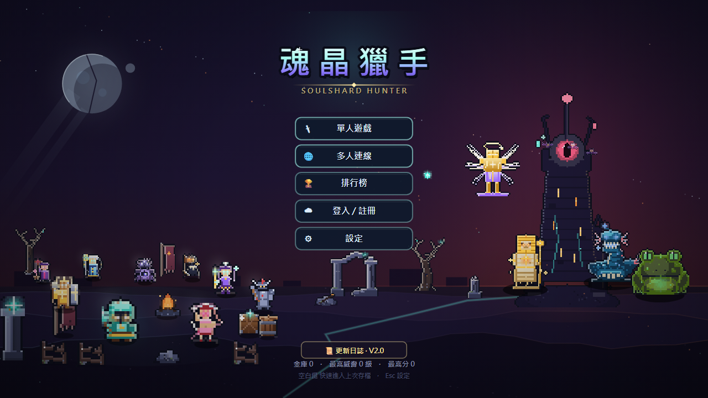

# Soulshard Hunter 美術複審報告（R28 更新後）

> 複審基準：`0d164cd96b8c411c3ccf03df5ca0fc9805b6423d`（`main`，2026-08-28）  
> 原審基準：`430443c5114d522c26a6e810e6d641a828289826`  
> 複審日期：2026-08-30  
> 結論：R28 已把專案從「內容完整但視覺批次不一致」推進到「具明確商業展示力、可進入定向拋光」。整體成熟度由 **66 / 100 提升至 79 / 100**。目前無 P0／P1；仍有 **4 項 P2** 與 **2 項 P3 驗證／整理工作**。

## 1. 執行結論

R28 是有效的大型美術收斂，不只是表面換色：10 生態加入結構地標與材質節奏、戰鬥 draw-order 與光束所有權重做、219 個圖示重繪、六個室內重組、DOM／Canvas token 收斂，並新增 27 張一致的角色厚塗肖像。標題、出擊選角、生態辨識、戰鬥警示與圖示語意，是本輪提升最明顯的區域。

但 R28 自評摘要有兩個需要 Claude 架構師重新判定的地方：

1. `ART_ROUND28_SUMMARY.md` 把 ART-01 標為「通過」，但同輪 `FINAL_REGRESSION.md` 明確證實只有 5 名角色整隻重建、17 名只調值階／rim、5 名完全未動；「27 名角色可只靠輪廓辨認」仍未達成。因此 ART-01 應判定為 **部分通過，殘留 P2**。
2. 27 張肖像本身品質與一致性良好，但程式引用追蹤顯示 `getPortrait → drawPortrait → drawSortie → render`，目前主要只整合到出擊選角。個人頁仍放大 16×18 sprite；因此 ART-05 應判定為 **大致通過，整合殘留 P2**，不宜宣告角色展示層已全站完成。

## 2. 範圍、方法與限制

- 將本機 `main` fast-forward 至遠端最新 SHA；更新範圍為 465 個檔案、11,009 行新增、2,919 行刪除。
- 重新建立 codebase knowledge graph，檢查 sprite registry、肖像引用、World draw-order、beam cue、UI token 與面板繪製路徑。
- 讀取 `docs/art/ART_SPEC.md`、R28 總結與最終回歸，逐項對照原審 ART-01～12。
- 獨立以乾淨本機狀態擷取標題、出擊、圖鑑、個人頁、登入與 27 肖像 contact sheet；另抽查 R28 的角色／敵人／圖示前後對照、10 生態灰階、密集戰鬥、室內與多解析度證據。
- 執行現行 frontend smoke；另記錄 runtime registry、canvas、頁面例外與圖片載入結果。
- 本輪是更新差異複審，不重複生成 R28 已存在的 144 MB 全量證據；需要動態判斷之處以本輪獨立畫面與 R28 最終證據交叉核對。
- 未完成 5 位真人「10 秒定位」測試、完整逐動畫循環、devicePixelRatio 2 高 DPI 實機與手機觸控。這些結論標為未驗證，不以靜態截圖替代。

## 3. 商業成熟度評分

評分仍以「主流 survivor-like 玩家是否會被首屏吸引，並能在高密度戰鬥持續辨識」為判準；屬有證據的專業判斷，不是玩家研究數據。

| 項目 | 原審 | 複審 | 變化與判斷 |
|---|---:|---:|---|
| 首屏吸引力 | 8.2 | **8.8** | 九人隊伍接地、rim light 與安全區更完整；現已可作商店頁主視覺基底。 |
| 視覺識別 | 7.4 | **8.3** | 魂晶青綠、暗色末日、厚塗肖像與生態地標形成更穩定的產品語彙。 |
| UI 層級 | 5.6 | **7.4** | token、標題帶、按鈕與 DOM chrome 明顯收斂；低資訊版面仍過空。 |
| 字體與可讀性 | 5.4 | **7.3** | 589 處字級／權重遷移有效；選角描述仍小且會把數字拆行。 |
| 色彩與明度 | 6.6 | **8.1** | 三色覺模擬與 beam 暗邊改善亮背景；verdant 等近色場景仍需動態真人確認。 |
| 像素尺度一致性 | 5.5 | **7.4** | 敵人與場景進步大；17 名角色的 sprite 輪廓仍沿用舊結構。 |
| 角色剪影 | 6.3 | **7.5** | 五名弱勢角色重建、27 肖像大幅補強商品力；小 sprite 尚未 27/27 收斂。 |
| 動畫 | 6.0 | **6.2** | 環境動態與 cue 增加；本輪未完整觀察全部動畫循環，信心有限。 |
| 場景深度 | 6.1 | **8.2** | 10 生態地標、地平線、vnoise 與六室內重組，使場景不再只靠色相。 |
| VFX／預警可讀性 | 6.0 | **8.4** | 八層 draw-order、三族 beam、Boss／elite 形狀冗餘是實質系統提升。 |
| 無障礙 | 6.3 | **8.1** | 三色覺 gate、暗邊、形狀與文字 token 顯著改善；真人辨識測試尚缺。 |
| 解析度適應 | 7.2 | **8.9** | 1280、1366、1920、2560×1440 真全高證據完整且比例穩定；DPR2 未驗證。 |

**總評：79 / 100（原審 66，+13）**

## 4. ART-01～12 複審判定

| ID | 原嚴重度 | 複審狀態 | 現在的判定 |
|---|---:|---|---|
| ART-01 | P1 | **部分通過 · P2** | 5 角色重建、17 僅值階微調、5 未動；敵人尺度已大幅改善。不得以填充率達標等同輪廓達標。 |
| ART-02 | P1 | **通過 · P3 驗證** | draw-order、beam family、Boss／elite 冗餘已建立；缺 5 人動態辨識測試。 |
| ART-03 | P1 | **部分通過 · P2** | token 化成功，但選角描述仍約 8–9 px 且逐字元換行會拆開百分比與小數。 |
| ART-04 | P1 | **通過** | 10／10 生態灰階仍可依地標與結構互辨，不再只靠色相。 |
| ART-05 | P1 | **大致通過 · P2** | 27 肖像品質統一且全數載入；目前展示面主要集中於出擊選角，個人頁仍使用放大 sprite。 |
| ART-06 | P2 | **通過 · P3 整理** | 219 個圖示已由抽象同模 glyph 改成具體物件，32 px 語意明顯提升；後續只需少量近似物件去重。 |
| ART-07 | P2 | **通過 · P3 整理** | 六室內尺度、相機 clamp、焦點設施與敘事物件已補齊；個別房間仍有散點道具／平台格感。 |
| ART-08 | P2 | **通過** | Canvas 與 DOM 已共用相近 token、四態與標題帶；emoji 已換 inline SVG。 |
| ART-09 | P2 | **通過 · P3 驗證** | 亮背景 beam 暗邊後量測 5.56–5.78:1；DPR2 與動態色覺辨識仍未實測。 |
| ART-10 | P2 | **未關閉 · P2** | 原訂低／中／高三檔 layout template 未實作；銀行、商店、空資料個人頁／圖鑑仍有大片無功能留白。 |
| ART-11 | P2 | **大致通過 · P3 整理** | vnoise、decal 群聚與牆 variant 解掉主要規律；少數 frost／desert／abyss 固定特徵磚仍可能形成可感知 motif。 |
| ART-12 | P3 | **通過** | 標題的隊伍尺度、接地、rim light 與四解析度安全區已收斂。 |

## 5. 剩餘問題矩陣（供 Claude 重新審查後派工）

### RE-01／ART-01 — 角色 sprite 輪廓仍未 27／27 收斂（P2）

- **影響範圍**：17 名僅值階微調角色、5 名完全未動角色；以 `ranger`、`g_ranger` 等同類職業最容易互相混淆。
- **證據**：[`FINAL_REGRESSION.md` 第 9 節](art-improve-2026-08/final/FINAL_REGRESSION.md)、[角色前後對照](art-improve-2026-08/final/cmp/cmp-characters-before-after.png)。最終回歸記錄 5 重建／17 微調／5 未動，並明確註記 ART-01 未收口。
- **玩家影響**：肖像能賣角色，但進入戰鬥後又退回接近的兜帽／直立人形；解鎖角色的「換人感」不足。
- **相關區域**：角色 sprite definitions、`src/engine/sprites.js` Painter API、角色裝備／武器輪廓層。
- **方向**：`Canvas/Painter`。先建立 27 人黑色 silhouette contact sheet，針對未達標者改頭肩比、持械方向、披風／角／盾的外輪廓，不再只調亮暗與填充率。
- **驗收**：去色、去名字、32 px 顯示時，27 名可由武器／頭肩／外套輪廓區分；相鄰同職角色不得只靠顏色辨認。

### RE-02／ART-03 — 選角卡小字與數值被逐字元拆行（P2）

- **影響範圍**：出擊角色卡，四種桌面解析度皆可出現。
- **證據**：[`FINAL_REGRESSION.md` 第 2 節](art-improve-2026-08/final/FINAL_REGRESSION.md)、[2560×1440 選角](art-improve-2026-08/final/res/sortie-2560x1440.png)、[本輪 1280×720 選角](art-reaudit-2026-08-30/current-sortie-1280x720.png)。既有證據可見「-10 / %」與「+0. / 3」。
- **玩家影響**：玩家會把 `+0.3` 掃讀成 `+0`；角色差異資訊在第一個高曝光決策點反而最難讀。
- **相關區域**：`src/engine/renderer.js` 的 wrap／clip helper、出擊卡文字組版。
- **方向**：`Canvas/Painter`。對數字、百分比、正負號與小數建立不可分割 token；卡片採「一句定位＋2–3 個短屬性」而非縮小長敘述。
- **驗收**：1280×720 與 2560×1440 下不拆數字 token；最小實際字高至少 10 px；以 2 秒掃視可讀出每卡主優勢。

### RE-03／ART-05 — 肖像層已完成，但高曝光介面整合不足（P2）

- **影響範圍**：個人頁、角色詳情／解鎖回饋；鎖定出擊卡。
- **證據**：[27 肖像 contact sheet](art-reaudit-2026-08-30/current-portraits-contact.png)、[出擊選角](art-reaudit-2026-08-30/current-sortie-1280x720.png)、[個人頁](art-reaudit-2026-08-30/current-personal-1280x720.png)。code graph inbound trace 只有 `getPortrait → drawPortrait → drawSortie → render`。
- **玩家影響**：最昂貴、最有商品力的角色資產只在一個流程發揮；個人頁仍以放大低解析 sprite 當主視覺。鎖定卡 `alpha ≈ 0.3` 又把角色 teaser 壓得過暗。
- **相關區域**：`src/game/ui/portraits.js`、`src/game/scenes/hub/render_personal.js` 與角色解鎖／詳情面板。
- **方向**：`混合`（現有 ImageGen 點陣資產＋Canvas/Painter 版面整合）。不再重生 27 張；優先重用現有資產，統一裁切、邊框、焦點與 fallback。
- **驗收**：個人頁以肖像作主要角色層、sprite 作遊戲內預覽；鎖定卡仍可辨認角色外形；所有使用處失敗時回退 sprite，且無 layout shift。

### RE-04／ART-10 — 低資訊面板仍缺密度版型（P2）

- **影響範圍**：銀行、商店、空資料圖鑑／個人頁與部分結果 overlay。
- **證據**：[R28 銀行面板](art-improve-2026-08/final/panels/bank-1280x720.png)、[本輪圖鑑](art-reaudit-2026-08-30/current-codex-1280x720.png)、[本輪個人頁](art-reaudit-2026-08-30/current-personal-1280x720.png)。R28 自評亦明列三檔 density template 延後。
- **玩家影響**：高資訊面板已更緊實，低資訊面板卻仍有巨大死區，造成看似半成品與不同團隊製作的落差。
- **相關區域**：各 Canvas panel renderer、panel frame／section helper。
- **方向**：`Canvas/Painter`。建立 compact／standard／showcase 三種面板版型；空狀態放教學、進度、預覽或下一步 CTA，而非單純拉大框。
- **驗收**：1280×720 下主要內容／有效裝飾佔可用面板 60–85%；無資料狀態仍有明確焦點與下一步；同一面板在四解析度不靠硬編絕對座標補洞。

### RE-05 — 尚缺動態真人與高 DPI 驗證（P3）

- **範圍**：ART-02、ART-09、動畫與 DPR2。
- **方向**：不先改美術；由 Claude 指派獨立 reviewer 執行 5 位未看說明測試、10 秒錄影定位題與 DPR2 截圖。記錄玩家定位時間、Boss／事件／玩家 beam 所有權答對率與細線銳利度。
- **驗收**：5／5 在 1 秒內指出玩家；三類 beam 所有權答對率 ≥90%；DPR2 無半像素模糊或 1 px 線消失。

### RE-06 — 少量場景 motif 與室內散點噪音（P3）

- **範圍**：frost／desert／abyss 的固定特徵磚，以及部分室內散點道具。
- **方向**：`Canvas/Painter`。只做小範圍 seed／密度調整與視覺焦點整理，不再整批重畫生態或室內。
- **驗收**：連續移動 30 秒不會注意到固定圖樣週期；室內每房第一焦點唯一、道具不與動線競爭。

## 6. 資產與狀態覆蓋

| 類別 | 複審結果 | 狀態 |
|---|---:|---|
| runtime sprite registry | **988**（原審 831，+157） | 已在瀏覽器 runtime 讀取；完整名稱保存於 `runtime.json`。 |
| 角色 registry | 27 | 全數存在；5 重建／17 微調／5 未動，依 RE-01 仍需定向處理。 |
| 角色肖像 | **27／27，全部 128×128** | 全數載入、風格一致；整合面不足，見 RE-03。 |
| 敵人／Boss | 63 | R28 前後對照 51／72 格有變動；reaper／pillar 等弱項已明顯改善。 |
| 武器 | 43 | registry 與 smoke 一致；圖示納入 219 重繪批次。 |
| 道具 | 28 | registry 與 smoke 一致；圖示納入重繪批次。 |
| 裝備 | 60 | registry 與 smoke 一致；圖示納入重繪批次。 |
| 能力 | 54 | registry 與 smoke 一致；圖示納入重繪批次。 |
| 天賦 | 20 | registry 與 smoke 一致；圖示納入重繪批次。 |
| 設施 | 11 | registry 與 smoke 一致；圖示納入重繪批次。 |
| 內容圖示 | 219 個視覺格完成重繪 | 具體物件語意已達標；只保留 P3 去重整理。 |
| 10 生態 | 10／10 | 灰階 contact sheet 可互辨；主要 ART-04 已關閉。 |
| 六室內 | 6／6 | 尺度、相機、焦點與動線已改善；保留 P3 散點整理。 |
| 主要 UI／DOM | 標題、出擊、圖鑑、個人、登入獨立複查；R28 全面板證據抽查 | ART-03、05、10 殘留如上；管理後台仍排除。 |

## 7. 驗證紀錄

- `npm run test:frontend`：**59／59 assertions passed**。
- registry：enemies 63、items 28、equipment 60、abilities 54、talents 20、facilities 11、weapons 43、characters 27。
- runtime：canvas 1280×720、`__GAME_ERROR__ = null`、未捕捉 page errors = 0。
- 27 張 portrait：全部存在、全部 128×128、contact sheet 載入成功。
- R28 多解析度證據：1280×720、1366×768、1920×1080、2560×1440；2560 為實際全高 1440，非裁切近似。
- 本複審未修改 runtime API、資料格式、遊戲邏輯或美術原始碼；工作樹相對 `origin/main` 無 tracked source diff。

## 8. 建議 Claude 架構師的派工順序

1. **先做獨立裁決，不直接照抄 R28 自評**：確認 RE-01、RE-03 的「部分通過」與文件矛盾，將 `ART_ROUND28_SUMMARY.md` 狀態校正為可追溯的真實結果。
2. **批次 A：角色展示系統**：由同一 Codex session 處理 RE-01 與 RE-03，避免 sprite 輪廓、portrait 版面與 fallback 被拆成互相矛盾的任務。只重畫未達標角色，不重生 27 肖像。
3. **批次 B：UI 密度與排版**：由另一 session 合併 RE-02 與 RE-04，先做不可分割文字 token 與三檔 panel template，再逐面板遷移。
4. **批次 C：驗證而非再設計**：獨立 reviewer 執行 RE-05；若動態測試通過，不再擴張 ART-02／09。
5. **批次 D：低風險末端拋光**：最後才做 RE-06。禁止再次發動全生態、全圖示或全室內重繪。

每個實作 session 必須回報：修改檔案、對應 finding、before／after、四解析度結果、registry／smoke、未解風險；不 commit、不 push，由 Claude 架構師二次審核後再決定整合。

## 9. 證據索引

- [本輪 runtime 與完整 sprite 名單](art-reaudit-2026-08-30/runtime.json)
- [本輪 27 肖像 contact sheet](art-reaudit-2026-08-30/current-portraits-contact.png)
- [本輪標題](art-reaudit-2026-08-30/current-title-1280x720.png)
- [本輪出擊選角](art-reaudit-2026-08-30/current-sortie-1280x720.png)
- [本輪圖鑑](art-reaudit-2026-08-30/current-codex-1280x720.png)
- [本輪個人頁](art-reaudit-2026-08-30/current-personal-1280x720.png)
- [本輪登入／DOM chrome](art-reaudit-2026-08-30/current-auth-1280x720.png)
- [R28 最終回歸](art-improve-2026-08/final/FINAL_REGRESSION.md)
- [R28 角色前後對照](art-improve-2026-08/final/cmp/cmp-characters-before-after.png)
- [R28 敵人前後對照](art-improve-2026-08/final/cmp/cmp-enemies-before-after.png)
- [R28 圖示前後對照](art-improve-2026-08/final/cmp/cmp-icons-before-after.png)
- [R28 十生態灰階](art-improve-2026-08/final/grey/greyscale-10biomes-320x180.png)
- [R28 沙漠 beam 暗邊修正](art-improve-2026-08/w5fix-after/stress-desert-1280x720.png)
- [原始全面美術審核](ART_AUDIT_2026-08-26.md)

